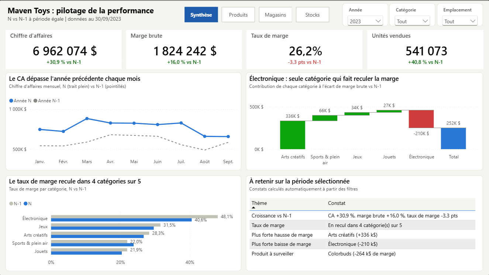
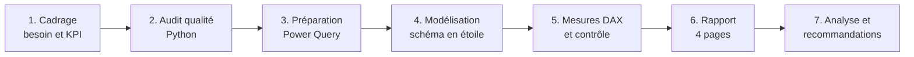
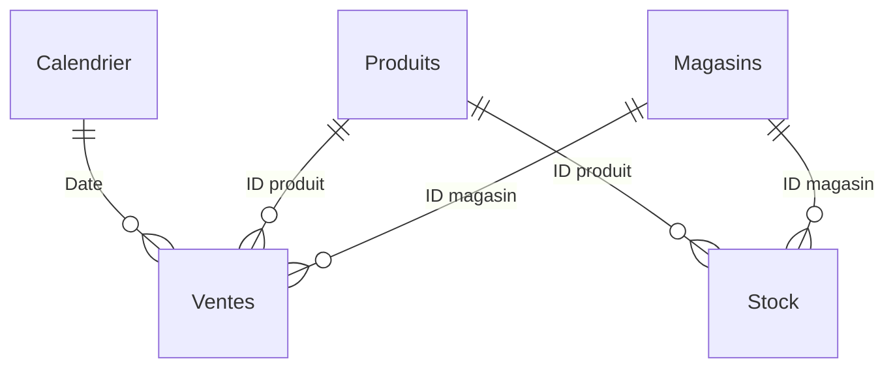
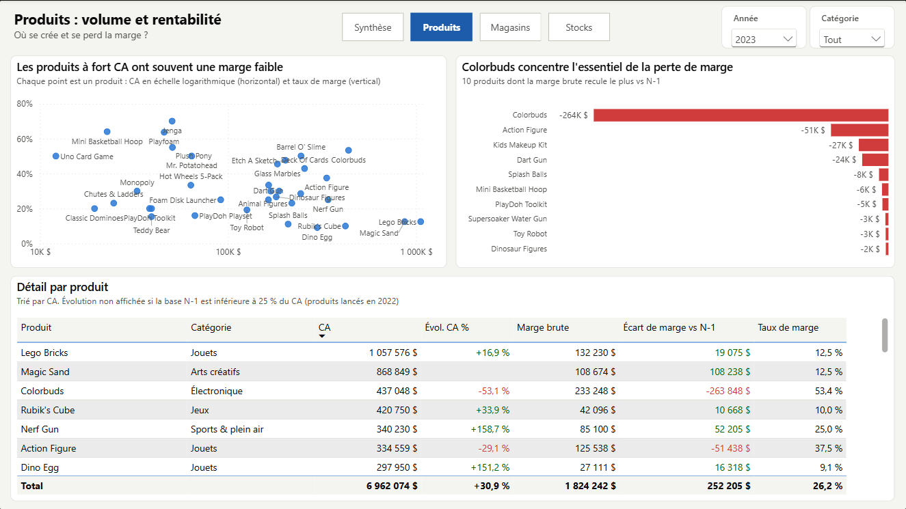
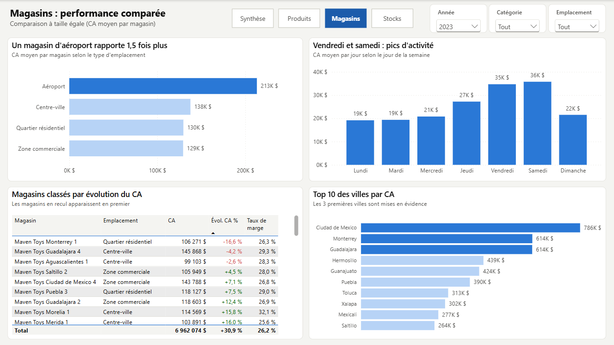
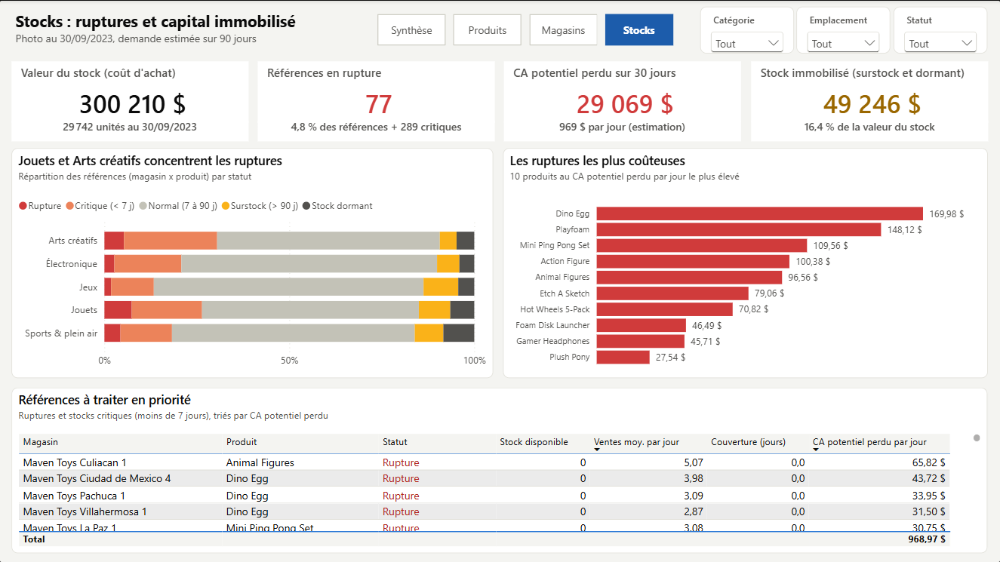

# Maven Toys : pilotage de la performance commerciale et des stocks


Analyse de 829 262 ventes d'une enseigne de 50 magasins de jouets pour répondre à une question de direction : **la croissance est-elle rentable, et où agir en priorité avant la fin d'année ?**



---

## En bref

| | |
|---|---|
| **Problématique** | La croissance 2023 est-elle rentable et durable, et où agir en priorité (produits, magasins, stocks) ? |
| **Livrable** | Rapport Power BI de 4 pages, script Python de contrôle qualité, synthèse et recommandations |
| **Résultat principal** | CA **+30,9 %** mais marge brute **+16,0 %** seulement : taux de marge **-3,3 pts**, entièrement dû au mix produits |
| **Impact chiffré** | **29 000 $** de CA perdu par mois à cause des ruptures, **49 000 $** de stock immobilisé |
| **Compétences** | Cadrage métier, audit qualité, Power Query, modélisation en étoile, DAX (time intelligence), data storytelling, recommandations |

---

## Sommaire

1. [Contexte métier](#1-contexte-métier)
2. [Problématique et objectifs](#2-problématique-et-objectifs)
3. [Données](#3-données)
4. [Démarche et méthodologie](#4-démarche-et-méthodologie)
5. [Outils et technologies](#5-outils-et-technologies)
6. [Modèle de données et mesures](#6-modèle-de-données-et-mesures)
7. [Le rapport Power BI](#7-le-rapport-power-bi)
8. [Résultats clés](#8-résultats-clés)
9. [Enseignements](#9-enseignements)
10. [Recommandations](#10-recommandations)
11. [Limites](#11-limites)
12. [Pistes d'amélioration](#12-pistes-damélioration)
13. [Compétences démontrées](#13-compétences-démontrées)
14. [Structure du dépôt et reproduction](#14-structure-du-dépôt-et-reproduction)

---

## 1. Contexte métier

**Maven Toys** est une enseigne fictive de **50 magasins de jouets au Mexique** (35 produits, 5 catégories).

Mise en situation : nous sommes en **octobre 2023**. La direction prépare les achats du 4e trimestre (décembre pèse 1,5 fois un mois moyen) et le budget 2024. Le chiffre d'affaires progresse fortement, mais le contrôle de gestion constate que **la marge ne suit pas**, et les magasins signalent des **ruptures de stock**.

En tant que Data Analyst de l'équipe Performance commerciale, ma mission est de construire un outil de pilotage et une analyse qui éclairent ces décisions.

| Destinataire | Décision à éclairer |
|---|---|
| Direction générale | Budget 2024, investissements |
| Direction commerciale | Assortiment, prix, produits à pousser |
| Direction des opérations | Suivi des magasins, organisation |
| Supply chain | Réapprovisionnement avant le pic de décembre |

## 2. Problématique et objectifs

> **La croissance de Maven Toys en 2023 est-elle rentable et durable, et où agir en priorité avant la fin d'année ?**

Objectifs de l'analyse :

1. **Mesurer** l'évolution du CA, de la marge et des volumes **à période égale** (janvier-septembre 2023 contre 2022).
2. **Expliquer** quelles catégories et quels produits font varier la marge.
3. **Comparer** les magasins et les types d'emplacement **à taille comparable**.
4. **Chiffrer** le coût des ruptures et le capital immobilisé en stock.
5. **Recommander** des actions priorisées, chacune associée à un indicateur de suivi.

Détail du cadrage : [docs/01_cadrage_besoin.md](docs/01_cadrage_besoin.md)

## 3. Données

Source : jeu de données **Mexico Toy Sales** de [Maven Analytics](https://mavenanalytics.io/data-playground) (données fictives).

| Table | Lignes | Contenu | Rôle |
|---|---:|---|---|
| Ventes | 829 262 | Date, magasin, produit, unités (janv. 2022 à sept. 2023) | Faits |
| Stock | 1 593 | Stock par magasin et produit (photo à date) | Faits |
| Produits | 35 | Nom, catégorie, coût, prix | Dimension |
| Magasins | 50 | Nom, ville, type d'emplacement, date d'ouverture | Dimension |
| Calendrier | 638 | Un jour par ligne | Dimension |

**Audit de qualité** : aucune valeur manquante ni doublon, mais plusieurs points à traiter :

- prix stockés en texte (`"$15.99 "`) et formats américains, mal interprétés par un Windows français ;
- faute de frappe dans une ville (`Cuidad de Mexico`) ;
- année 2023 incomplète, qui fausse toute comparaison annuelle directe ;
- stock sans historique (photo unique) ;
- prix fixes : toute baisse du taux de marge est un effet mix.

Détail de l'audit : [docs/02_qualite_donnees.md](docs/02_qualite_donnees.md)

## 4. Démarche et méthodologie



| Étape | Ce qui a été fait | Pourquoi |
|---|---|---|
| 1. Cadrage | Parties prenantes, problématique, 4 questions, 8 KPI, règles de gestion | Construire un rapport qui répond à des décisions |
| 2. Audit qualité | Script Python : complétude, doublons, intégrité, formats, périmètre | Ne pas bâtir d'indicateurs sur des données mal comprises |
| 3. Préparation | Nettoyage des prix, culture `en-US`, correction de la ville, traduction des libellés, suppression d'une colonne inutile, paramètre de chemin | Rendre le traitement fiable, reproductible et portable |
| 4. Modélisation | Schéma en étoile, relations à sens unique, table de dates marquée | Des filtres prévisibles et des calculs N-1 corrects |
| 5. Mesures DAX | 37 mesures et 5 colonnes calculées, contrôlées par rapport au script Python | Garantir la justesse des chiffres avant publication |
| 6. Rapport | 4 pages orientées questions, thème accessible, navigation | Rendre l'analyse lisible par un public non technique |
| 7. Analyse | Enseignements, recommandations priorisées, limites | Transformer les chiffres en décisions |

**Choix méthodologiques importants**

- **Comparaison à période égale** (`SAMEPERIODLASTYEAR`) : janvier-septembre contre janvier-septembre, pour neutraliser la saisonnalité et l'année 2023 incomplète.
- **Analyse par magasin** (CA moyen par magasin) : pour ne pas confondre la taille d'un groupe avec sa performance.
- **Écart de marge en valeur** plutôt qu'en % : les produits lancés en cours de période rendent les pourcentages trompeurs.
- **Risque de stock** : couverture = stock / ventes journalières des 90 derniers jours ; seuils de 7 et 90 jours.
- **Réconciliation** : chaque KPI du rapport est comparé à une valeur calculée indépendamment en Python.

## 5. Outils et technologies

| Outil | Usage |
|---|---|
| **Power BI Desktop** | Rapport interactif |
| **Power Query (M)** | Import, nettoyage et transformation des données |
| **DAX** | Mesures, comparaisons temporelles, colonnes calculées, vue Requête DAX pour les tests |
| **Python (pandas)** | Audit de qualité et calcul des valeurs de référence |
| **Git / GitHub** | Versionnage du code, de la documentation et du rapport |
| **IntelliJ IDEA** | Édition des scripts et de la documentation |

## 6. Modèle de données et mesures



Deux tables de faits partagent les dimensions `Produits` et `Magasins` : un même filtre « Catégorie » agit sur les ventes et sur le stock. Le stock, photo sans date, n'est volontairement pas relié au calendrier.

| Famille de mesures | Exemples |
|---|---|
| Ventes et rentabilité | CA, Marge brute, Taux de marge, CA moyen par magasin |
| Comparaison N-1 | CA N-1, Évol. CA %, Écart marge brute vs N-1, Écart taux de marge (pts) |
| Stock | Valeur du stock, Nb ruptures, CA potentiel perdu, Valeur stock immobilisé |
| Libellés dynamiques | Libellé évol. CA (« +30,9 % vs N-1 »), couleurs conditionnelles |

Code source lisible : [requêtes Power Query](powerbi/power-query), [mesures et colonnes DAX](powerbi/dax), [thème](powerbi/theme/maven-toys-theme.json).

## 7. Le rapport Power BI

Fichier : [`powerbi/MavenToys_Pilotage.pbix`](powerbi/MavenToys_Pilotage.pbix)

| Page | Question | Contenu |
|---|---|---|
| **Synthèse** | Comment évolue la performance ? | KPI avec évolution N-1, CA mensuel N vs N-1, cascade de l'écart de marge par catégorie, taux de marge par catégorie |
| **Produits** | Quels produits font varier la marge ? | Matrice volume / rentabilité, produits en plus forte baisse, détail avec mise en forme conditionnelle |
| **Magasins** | Quels magasins performent le mieux ? | CA moyen par magasin par emplacement, activité par jour de la semaine, matrice des magasins, top villes |
| **Stocks** | Où sont les risques de stock ? | Ruptures, CA perdu, stock immobilisé, statut par catégorie, liste des références prioritaires |

| Produits | Magasins | Stocks |
|---|---|---|
|  |  |  |

Guide de construction pas à pas : [docs/03_guide_power_bi.md](docs/03_guide_power_bi.md)

## 8. Résultats clés

**Janvier-septembre 2023 comparé à janvier-septembre 2022**

| Indicateur | 2022 | 2023 | Évolution |
|---|---:|---:|---:|
| Chiffre d'affaires | 5 320 116 $ | 6 962 074 $ | **+30,9 %** |
| Marge brute | 1 572 037 $ | 1 824 242 $ | **+16,0 %** |
| Taux de marge | 29,5 % | 26,2 % | **-3,3 pts** |
| Unités vendues | 384 415 | 541 073 | +40,8 % |

**Stock au 30/09/2023**

| Indicateur | Valeur |
|---|---:|
| Références en rupture | 77 (4,8 %) |
| Références critiques (moins de 7 jours de stock) | 289 (18,1 %) |
| CA potentiel perdu sur 30 jours | 29 069 $ |
| Stock immobilisé (surstock et sans vente) | 49 246 $ (16,4 % de la valeur) |

## 9. Enseignements

1. **La croissance dilue la rentabilité.** Le CA progresse deux fois plus vite que la marge. Les prix étant fixes, la baisse du taux de marge est un pur effet mix : -1,6 pt entre catégories, -1,8 pt au sein des catégories.
2. **Arts créatifs porte la croissance, mais à faible marge.** CA multiplié par 3,5 (+335 745 $ de marge), tiré par Magic Sand : +865 000 $ de CA à seulement 12,5 % de marge.
3. **L'électronique détruit 210 000 $ de marge.** Colorbuds, produit le plus rentable de l'enseigne (20,8 % de la marge totale), a perdu 60 % de ses volumes en 18 mois, sans aucune rupture de stock : c'est un problème de demande.
4. **Les aéroports sont le format le plus productif.** 430 000 $ par magasin, soit 1,5 fois plus que les autres emplacements, et la plus forte croissance (+37,5 %). Le poids du centre-ville (57 % du CA) s'explique par son nombre de magasins, pas par sa performance.
5. **47 magasins sur 50 progressent.** Monterrey 1 est le seul recul marqué (-16,6 %).
6. **Le vendredi et le samedi font 1,8 fois le CA du lundi.**
7. **Les stocks sont mal répartis.** Playfoam, lancé mi-août 2023, est déjà en rupture ou critique dans 27 magasins sur 49, alors que Dinosaur Figures ou PlayDoh Playset dorment en rayon.

Analyse complète : [docs/04_resultats_recommandations.md](docs/04_resultats_recommandations.md)

## 10. Recommandations

| Priorité | Action | Indicateur de suivi |
|---|---|---|
| 1 | Réapprovisionner les 77 références en rupture avant décembre, en priorité Dino Egg, Playfoam et Mini Ping Pong Set | CA potentiel perdu |
| 2 | Dimensionner les stocks de lancement sur les ventes réelles des 2 premières semaines | Couverture des nouveaux produits |
| 3 | Diagnostiquer le déclin de Colorbuds et préparer un produit de remplacement à forte marge | Marge brute Électronique |
| 4 | Tester une hausse de prix ou des offres groupées sur Magic Sand et Lego Bricks | Taux de marge par produit |
| 5 | Écouler le stock immobilisé (promotions, transferts entre magasins) | Valeur stock immobilisé |
| 6 | Étudier de nouvelles ouvertures en aéroport | CA moyen par magasin |
| 7 | Analyser les causes du recul de Monterrey 1 | Évol. CA par magasin |
| 8 | Adapter effectifs et livraisons au pic du vendredi et du samedi | CA moyen par jour |

## 11. Limites

- **Données fictives** : le projet démontre une démarche, pas la situation d'une entreprise réelle.
- **Pas d'historique de prix, de promotions ni de coûts** : effet prix et effet volume impossibles à séparer.
- **Stock = photo unique** : pas de rotation de stock ni de durée des ruptures.
- **CA perdu probablement sous-estimé** : une référence en rupture depuis longtemps a peu vendu sur 90 jours.
- **41 couples magasin x produit vendus mais absents de l'inventaire** : risque non mesuré.
- **Marge brute uniquement** : pas de loyers ni de salaires, donc pas de rentabilité nette par magasin.
- **Seuils de stock (7 et 90 jours) hypothétiques** : à valider avec les délais réels de réapprovisionnement.

## 12. Pistes d'amélioration

- Prévision des ventes du 4e trimestre pour dimensionner les commandes.
- Analyse ABC des produits et suivi dédié des lancements.
- Publication sur Power BI Service avec actualisation planifiée et sécurité par ligne (un directeur ne voit que son magasin).
- Format PBIP pour versionner chaque modification du rapport dans Git.
- Alimentation depuis une base SQL plutôt que des fichiers CSV.

## 13. Compétences démontrées

| Compétence | Mise en œuvre dans le projet |
|---|---|
| Compréhension du besoin métier | Parties prenantes, problématique, questions et KPI définis avant tout développement |
| Qualité des données | Audit reproductible, anomalies documentées et traitées |
| Préparation des données | Power Query : nettoyage, typage avec culture, paramètre, optimisation du modèle |
| Modélisation | Schéma en étoile à deux tables de faits, table de dates, relations maîtrisées |
| DAX | `CALCULATE`, `SUMX` / `RELATED`, `SAMEPERIODLASTYEAR`, variables, gestion des cas limites |
| Esprit critique | Correction d'erreurs d'interprétation de la version initiale (effet de taille, année partielle) |
| Rigueur | Réconciliation systématique des KPI entre Power BI et Python |
| Data visualisation | Choix des graphiques par question, palette accessible, titres porteurs de sens |
| Communication | Synthèse pour la direction, recommandations priorisées et mesurables, limites assumées |

## 14. Structure du dépôt et reproduction

```text
maven-toys-powerbi-analytics/
├── data/raw/                    Données sources (CSV) et dictionnaire des données
├── analysis/
│   ├── audit_donnees.py         Audit qualité et valeurs de référence
│   └── requirements.txt
├── powerbi/
│   ├── MavenToys_Pilotage.pbix  Rapport Power BI
│   ├── power-query/             Requêtes M commentées
│   ├── dax/                     Colonnes calculées et mesures commentées
│   └── theme/                   Thème Power BI (JSON)
└── docs/
    ├── 01_cadrage_besoin.md
    ├── 02_qualite_donnees.md
    ├── 03_guide_power_bi.md
    ├── 04_resultats_recommandations.md
    └── images/                  Captures du rapport
```

**Reproduire l'analyse**

1. Cloner le dépôt.
2. Lancer l'audit (Python 3.10 ou plus) :

```bash
pip install -r analysis/requirements.txt
```

```bash
python analysis/audit_donnees.py
```

3. Ouvrir `powerbi/MavenToys_Pilotage.pbix` dans Power BI Desktop.
4. **Transformer les données > Modifier les paramètres** : indiquer le chemin local du dossier `data/raw/` (terminé par `\`), puis **Actualiser**.

---

**Auteur** : GomuGomuNo01 · [GitHub](https://github.com/GomuGomuNo01)

*Projet réalisé dans le cadre de ma formation au métier de Data Analyst, à partir du jeu de données Maven Toys de Maven Analytics.*
