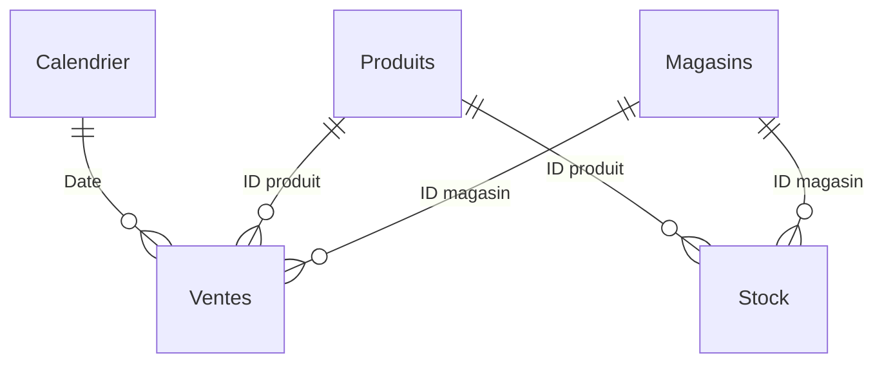

# 3. Guide de construction du rapport Power BI

> Guide écrit pour **Power BI Desktop 2.157** (interface en français, noms anglais entre parenthèses).
> Chaque étape précise **ce qu'il faut faire** et **pourquoi** on le fait dans un vrai projet.
>
> Durée estimée : 4 à 6 heures, pauses comprises.

## Le rapport final est déjà dans le dépôt

Le rapport terminé est fourni au format **projet Power BI (PBIP)** : [`powerbi/MavenToys_Pilotage.pbip`](../powerbi/MavenToys_Pilotage.pbip).

| Dossier | Contenu | Format |
|---|---|---|
| `MavenToys_Pilotage.SemanticModel/` | Modèle : tables, requêtes M, relations, 62 mesures, colonnes calculées | TMDL (texte) |
| `MavenToys_Pilotage.Report/` | Rapport : 4 pages, 49 visuels, thème | PBIR (JSON) |

**Pourquoi PBIP plutôt que `.pbix` ?** Un `.pbix` est un fichier binaire : Git ne voit pas ce qui a changé. Avec PBIP, chaque mesure et chaque visuel est un fichier texte : on peut relire une modification, la commenter ou revenir en arrière, comme pour du code. C'est le format recommandé par Microsoft pour travailler en équipe.

**Ouvrir le rapport fourni**

1. Double-cliquer sur `powerbi/MavenToys_Pilotage.pbip`.
2. **Accueil > Transformer les données > Modifier les paramètres** : indiquer le chemin local de `data\raw\` (terminé par `\`).
3. Cliquer sur **Actualiser maintenant** dans le bandeau jaune (les données ne sont pas stockées dans le dépôt).

**Utiliser ce guide** pour comprendre chaque choix, ou pour reconstruire le rapport vous-même dans un fichier d'entraînement : c'est le meilleur moyen de pouvoir l'expliquer en entretien.

## Sommaire

0. [Préparation](#étape-0--préparation-5-min)
1. [Options du fichier](#étape-1--options-du-fichier-5-min)
2. [Préparation des données (Power Query)](#étape-2--préparation-des-données-power-query-30-min)
3. [Modèle de données](#étape-3--modèle-de-données-30-min)
4. [Colonnes calculées du stock](#étape-4--colonnes-calculées-du-stock-15-min)
5. [Mesures DAX](#étape-5--mesures-dax-30-min)
6. [Thème](#étape-6--thème-5-min)
7. [Pages du rapport](#étape-7--pages-du-rapport-2-à-3-h)
8. [Finitions](#étape-8--finitions-20-min)
9. [Contrôle qualité](#étape-9--contrôle-qualité-15-min)
10. [Captures et versionnage](#étape-10--captures-et-versionnage-10-min)

---

## Étape 0 : Préparation (5 min)

**À faire**

1. Vérifier que vous êtes sur la branche `dev` (IntelliJ : en bas à droite, ou `git branch` dans le terminal).
2. Optionnel mais recommandé : exécuter le script d'audit pour avoir les chiffres de référence sous les yeux.

```bash
python analysis/audit_donnees.py
```

**Pourquoi ?** Le script donne des valeurs calculées indépendamment de Power BI. À l'étape 9, vous comparerez les deux : c'est ainsi qu'un analyste prouve que ses chiffres sont justes avant de les présenter.

---

## Étape 1 : Options du fichier (5 min)

**À faire**

1. Ouvrir Power BI Desktop > **Nouveau rapport**.
2. **Fichier > Enregistrer sous** : un fichier d'entraînement hors du dépôt (ex. `Documents/MavenToys_Entrainement.pbix`), pour ne pas écraser le projet fourni.
3. **Fichier > Options et paramètres > Options > Fichier actif > Chargement des données** :
   - décocher **Date/heure automatique** (Auto date/time) ;
   - décocher **Détecter automatiquement les nouvelles relations** (Autodetect new relationships).
4. **Fichier actif > Paramètres régionaux** : paramètres régionaux du modèle = **Français (France)**.

**Pourquoi ?**

- *Date/heure automatique* crée une table de dates cachée pour **chaque** colonne date. Cela alourdit le modèle et entre en conflit avec notre propre calendrier.
- *Détection automatique des relations* peut créer des relations incorrectes. Un analyste crée ses relations volontairement et sait expliquer chacune.

---

## Étape 2 : Préparation des données (Power Query) (30 min)

**Le rôle de Power Query** : nettoyer et mettre en forme les données **avant** qu'elles n'entrent dans le modèle. Règle d'or : transformer le plus en amont possible. Chaque étape est enregistrée et rejouée à chaque actualisation, ce qui rend le traitement **reproductible**.

### 2.1 Créer le paramètre du dossier

1. **Accueil > Transformer les données** : l'éditeur Power Query s'ouvre.
2. **Accueil > Gérer les paramètres > Nouveau paramètre** (Manage parameters) :
   - Nom : `DossierDonnees`
   - Type : **Texte**
   - Valeur actuelle : le chemin complet du dossier `data\raw\` **terminé par `\`**, par exemple
     `D:\PROJET PERSO\DATA\BI Dashboard (Power BI )\maven-toys-powerbi-analytics\data\raw\`
3. **OK**.

**Pourquoi ?** Le chemin n'est écrit qu'à un seul endroit. Si quelqu'un clone votre dépôt, il ne modifie que ce paramètre.

### 2.2 Créer les 5 requêtes

Pour chaque fichier du dossier [`powerbi/power-query/`](../powerbi/power-query) (`01_Ventes.pq` à `05_Calendrier.pq`) :

1. **Accueil > Nouvelle source > Requête vide** (Blank query).
2. **Accueil > Éditeur avancé** (Advanced Editor).
3. Tout sélectionner, **coller le contenu du fichier** (ouvert dans IntelliJ), **Terminé**.
4. Renommer la requête dans le volet **Paramètres de la requête > Nom** : `Ventes`, `Produits`, `Magasins`, `Stock`, `Calendrier`.
5. Parcourir les **Étapes appliquées** à droite : cliquer sur chaque étape montre l'état des données à ce moment. Lisez les commentaires `//` du code, ils expliquent chaque transformation.

**Pourquoi coller du code plutôt que cliquer ?** Les deux produisent exactement le même résultat (l'interface génère ce code M). Le code est plus rapide, versionné dans Git, et relisible. En entretien, vous pouvez montrer les deux approches.

**Points à vérifier**

| Requête | Vérification |
|---|---|
| Produits | `Prix unitaire` de Action Figure = **15,99** (et non 1 599) |
| Magasins | La ville `Ciudad de Mexico` est bien orthographiée |
| Calendrier | Première date 01/01/2022, dernière 30/09/2023, colonne `Mois` = `Janv.`, `Févr.`... |
| Ventes | Pas de colonne `Sale_ID`, pas d'erreur dans `Date` |

Si une icône d'erreur apparaît : vérifier que `DossierDonnees` se termine bien par `\`.

**Leçon tirée de la construction** : la première version du calendrier renvoyait « Identificateur non valide ». En M, un nom de colonne contenant un caractère spécial comme `°` doit s'écrire `[#"N° mois"]` et non `[N° mois]`. Les accents (`[Année]`) sont acceptés, les symboles non.

### 2.3 Créer la table des mesures

1. **Accueil > Fermer et appliquer** (le chargement des 829 262 ventes prend quelques secondes).
2. De retour dans le rapport : **Accueil > Entrer des données** (Enter data).
3. Nom : `_Mesures`, ne rien saisir, **Charger**.

**Pourquoi ?** Regrouper toutes les mesures dans une table dédiée les rend faciles à trouver. Le `_` la place en tête de liste.

---

## Étape 3 : Modèle de données (30 min)

**Le rôle du modèle** : relier les tables pour qu'un filtre (ex. une catégorie) se propage correctement aux chiffres.

### 3.1 Schéma cible : modèle en étoile



- **Tables de faits** (`Ventes`, `Stock`) : les événements mesurables, beaucoup de lignes.
- **Dimensions** (`Produits`, `Magasins`, `Calendrier`) : les axes d'analyse, peu de lignes.

**Pourquoi un modèle en étoile ?** C'est la structure recommandée par Microsoft : formules DAX plus simples, filtres prévisibles, meilleures performances.

### 3.2 Créer les relations

**Vue Modèle** (icône à gauche) > glisser la colonne de la table de faits sur la colonne de la dimension, ou **Accueil > Gérer les relations > Nouvelle relation**.

| De (côté plusieurs) | Vers (côté un) | Cardinalité | Direction du filtre |
|---|---|---|---|
| `Ventes[Date]` | `Calendrier[Date]` | Plusieurs à un | Unique |
| `Ventes[ID produit]` | `Produits[ID produit]` | Plusieurs à un | Unique |
| `Ventes[ID magasin]` | `Magasins[ID magasin]` | Plusieurs à un | Unique |
| `Stock[ID produit]` | `Produits[ID produit]` | Plusieurs à un | Unique |
| `Stock[ID magasin]` | `Magasins[ID magasin]` | Plusieurs à un | Unique |

**Pourquoi ?**

- *Direction unique* : le filtre descend de la dimension vers les faits. Les filtres bidirectionnels créent des ambiguïtés et des résultats difficiles à expliquer.
- *Stock non relié au calendrier* : le stock est une photo sans date. Le relier au calendrier n'aurait pas de sens.
- *Produits et Magasins partagés par Ventes et Stock* : un seul segment « Catégorie » filtre à la fois les ventes et le stock.

### 3.3 Marquer la table de dates

**Vue Table** > table `Calendrier` > **Outils de table > Marquer comme table de dates** > colonne `Date`.

**Pourquoi ?** C'est indispensable pour que `SAMEPERIODLASTYEAR` (comparaison N-1) fonctionne correctement quand on filtre par année ou par mois.

### 3.4 Tris et affichage

**Vue Table**, sélectionner la colonne puis **Outils de colonne > Trier par colonne** :

| Colonne | Trier par |
|---|---|
| `Calendrier[Mois]` | `N° mois` |
| `Calendrier[Mois-année]` | `Clé année-mois` |
| `Calendrier[Jour semaine]` | `N° jour semaine` |

**Pourquoi ?** Sans cela, les mois s'affichent par ordre alphabétique (Août, Avr., Déc....).

Puis dans la **Vue Modèle**, clic droit > **Masquer dans la vue rapport** :

- `Ventes` : `Date`, `ID magasin`, `ID produit`
- `Stock` : `ID magasin`, `ID produit`
- `Calendrier` : `N° mois`, `Clé année-mois`, `N° jour semaine`
- `_Mesures` : la colonne `Colonne1`

Enfin, sélectionner `Calendrier[Année]` > **Propriétés > Résumer par : Aucun**.

**Pourquoi ?** Un utilisateur doit filtrer par `Produits[Catégorie]`, jamais par une clé technique. Masquer les clés évite les erreurs et simplifie la liste des champs. « Résumer par : Aucun » évite que Power BI additionne les années (2022 + 2023 = 4045).

---

## Étape 4 : Colonnes calculées du stock (15 min)

**Vue Table** > table `Stock` > **Outils de table > Nouvelle colonne**.

Créer **dans l'ordre** les 5 colonnes du fichier [`powerbi/dax/01_colonnes_calculees_stock.dax`](../powerbi/dax/01_colonnes_calculees_stock.dax) : `Ventes 90 j`, `Ventes moy. par jour`, `Couverture (jours)`, `Ordre statut`, `Statut stock`.

Ensuite : `Statut stock` > **Trier par colonne > Ordre statut**, puis masquer `Ordre statut`.

**Colonne calculée ou mesure ? La question clé en entretien.**

| | Colonne calculée | Mesure |
|---|---|---|
| Calculée | Une fois, au chargement, ligne par ligne | À chaque interaction, selon les filtres |
| Stockée | Oui (occupe de la mémoire) | Non |
| Utilisable comme axe ou segment | Oui | Non |
| Exemple ici | `Statut stock` d'une référence | `CA`, qui change selon la catégorie filtrée |

Le statut d'une référence ne dépend d'aucun filtre et doit servir de **légende** et de **segment** : c'est donc une colonne.

**Contrôle** : dans la vue Table, filtrer `Statut stock` = Rupture : **77 lignes**.

---

## Étape 5 : Mesures DAX (30 min)

### 5.1 Créer toutes les mesures en une fois

1. Icône **Vue Requête DAX** (DAX query view) dans la barre de gauche.
2. Coller le contenu de [`powerbi/dax/02_mesures.dax`](../powerbi/dax/02_mesures.dax).
3. **Exécuter** : trois tableaux de contrôle s'affichent dans les résultats.
4. **Mettre à jour le modèle avec les modifications** (Update model with changes) : les 62 mesures sont ajoutées à `_Mesures`.

**Pourquoi la vue Requête DAX ?** Elle permet de tester des mesures **avant** de les ajouter au modèle, puis de toutes les créer d'un clic. C'est aussi l'outil de débogage d'un analyste.

### 5.2 Comprendre les 4 mesures essentielles

**`CA`** : `SUMX ( Ventes, Ventes[Unités] * RELATED ( Produits[Prix unitaire] ) )`
Le prix est dans `Produits`, les unités dans `Ventes`. `SUMX` parcourt chaque vente, `RELATED` va chercher le prix du produit correspondant grâce à la relation, puis on additionne.

**`Taux de marge`** : `DIVIDE ( [Marge brute], [CA] )`
Un ratio se calcule toujours à partir des totaux (et non en moyennant des taux). `DIVIDE` renvoie un vide au lieu d'une erreur si le CA est nul.

**`CA N-1`** : `CALCULATE ( [CA], SAMEPERIODLASTYEAR ( Calendrier[Date] ) )`
`CALCULATE` modifie le contexte de filtre : il remplace les dates sélectionnées (janv.-sept. 2023) par les mêmes dates un an plus tôt (janv.-sept. 2022). C'est ce qui garantit la comparaison **à période égale**.

**`Écart marge brute vs N-1`** : alimente le graphique en cascade. Il répond directement à la question « d'où vient la variation de la marge ? ».

**`Écart marge brute (10 plus fortes baisses)`** : `RANKX ( ALLSELECTED ( Produits[Produit] ), ... )` classe les produits et renvoie un vide au-delà du 10e. Le visuel masque les lignes vides : on obtient un top 10 sans filtre caché, et la logique est lisible dans le modèle.

### 5.3 Formats et dossiers d'affichage

**Vue Modèle** > sélectionner plusieurs mesures avec **Ctrl + clic** > volet **Propriétés** :

| Format | Mesures |
|---|---|
| Devise, symbole `$ Anglais (États-Unis)`, 0 décimale | CA, Coût des ventes, Marge brute, CA N-1, Marge brute N-1, Écart marge brute vs N-1, CA moyen par magasin, CA moyen par jour, Valeur du stock, Valeur stock immobilisé, CA potentiel perdu sur 30 j, Écart marge brute (10 plus fortes baisses), CA (10 premières villes) |
| Devise, 2 décimales | CA moyen par vente, CA potentiel perdu par jour, CA perdu par jour (10 premiers produits) |
| Pourcentage, 1 décimale | Taux de marge, Taux de marge N-1, Évol. CA %, Évol. CA % (hors lancements), Évol. marge brute %, Évol. unités %, % références en rupture, % stock immobilisé |
| Nombre entier, séparateur de milliers | Unités vendues, Unités vendues N-1, Nb ventes, Nb magasins actifs, Stock disponible (unités), Nb références, Nb ruptures, Nb références critiques |
| Nombre décimal, 1 décimale | Écart taux de marge (pts), Couverture moyenne (jours) |
| Date courte | Date de référence stock |

Dans le même volet, renseigner **Dossier d'affichage** : `1. Ventes et rentabilité`, `2. Comparaison N-1`, `3. Libellés et couleurs`, `4. Stock`, `5. Classements` (en suivant les sections du fichier). Les mesures de libellés et de couleurs sont du texte : pas de format à définir.

**Pourquoi ?** Un chiffre mal formaté (« 0,28 » au lieu de « 27,8 % », « 14444572,35 » au lieu de « 14 444 572 $ ») est l'erreur la plus visible d'un rapport. Les dossiers rendent le modèle lisible par un collègue.

---

## Étape 6 : Thème (5 min)

**Affichage > Thèmes > Rechercher des thèmes** (Browse for themes) > [`powerbi/theme/maven-toys-theme.json`](../powerbi/theme/maven-toys-theme.json).

**Pourquoi ?** Le thème applique d'un coup les couleurs, polices, fonds et bordures à tous les visuels. La palette a été vérifiée pour rester lisible par les personnes daltoniennes. Un rapport cohérent visuellement inspire confiance.

**Convention de couleurs à respecter** (dans chaque visuel concerné, **Format > Couleurs**) :

| Élément | Couleur |
|---|---|
| Arts créatifs, Électronique, Jeux, Jouets, Sports & plein air | Couleurs 1 à 5 du thème, dans cet ordre (ordre alphabétique par défaut) |
| Année analysée (N) | Bleu `#2A78D6` |
| Année précédente (N-1) | Gris `#C3C2B7` en barres, gris foncé `#898781` en pointillés sur les courbes |
| Élément mis en évidence / autres éléments | Bleu `#2A78D6` / bleu clair `#B7D3F6` |
| Hausse / baisse (cascade, évolutions) | Vert `#0CA30C` (texte `#006300`) / Rouge `#D03B3B`, total en bleu `#2A78D6` |
| Rupture, Critique, Normal, Surstock, Stock dormant | `#D03B3B`, `#EC835A`, `#C3C2B7`, `#FAB219`, `#52514E` |

**Pourquoi ?** Une couleur doit toujours désigner la même chose d'un visuel à l'autre. Le rouge est réservé aux signaux négatifs : on ne l'utilise pas pour une catégorie.

---

## Étape 7 : Pages du rapport (2 à 3 h)

**Principes appliqués sur toutes les pages**

- **Lecture en Z** : les KPI en haut, le « pourquoi » au milieu, le détail en bas.
- **Titres qui disent quelque chose** : un titre de visuel pose la question à laquelle il répond.
- **Un seul axe par graphique** : pas de graphique combiné à deux échelles (CA et taux de marge sur le même visuel), source fréquente de mauvaise lecture.
- **Étiquettes de données** activées sur les barres : on lit la valeur sans deviner.

Renommer les pages (double-clic sur l'onglet) : `Synthèse`, `Produits`, `Magasins`, `Stocks`.

### Page 1 : Synthèse (répond à Q1 et Q2)

```text
+--------------------------------------------------------------------------+
| Titre + navigation                     [Année] [Catégorie] [Emplacement] |
+----------------+----------------+----------------+-----------------------+
|  CA            |  Marge brute   |  Taux de marge |  Unités vendues       |
|  +30,9 % vs N-1|  +16,0 % vs N-1|  -3,3 pts      |  +40,8 % vs N-1       |
+----------------+----------------+----------------+-----------------------+
|  Courbe : CA mensuel N vs N-1         |  Cascade : écart de marge brute  |
|                                       |  vs N-1 par catégorie            |
+---------------------------------------+----------------------------------+
|  Barres : taux de marge N vs N-1      |  Zone de texte : constats clés   |
|  par catégorie                        |                                  |
+---------------------------------------+----------------------------------+
```

| Visuel | Configuration | Pourquoi |
|---|---|---|
| **Zone de texte** titre | « Maven Toys : pilotage de la performance » + sous-titre « N vs N-1 à période égale, données au 30/09/2023 » | Le lecteur sait où il est et de quand datent les chiffres |
| **Navigateur de pages** | **Insérer > Boutons > Navigateur > Navigateur de pages**. Format : bouton actif rempli en bleu foncé `#1C5CAB`, texte blanc ; boutons inactifs blancs à contour gris | La page courante se repère d'un coup d'œil |
| **Segment** Année | Champ `Calendrier[Année]`, style **Liste déroulante**, **Sélection unique** activée, sélectionner **2023** | Les mesures N-1 exigent une seule année |
| **Segments** Catégorie, Type d'emplacement | Style **Liste déroulante** | Filtres secondaires, peu encombrants |
| **4 cartes KPI** (2 cartes empilées chacune) | Carte 1 : `CA` (police 24, unités d'affichage « Aucune »), titre gris en 11 pt. Carte 2 : `Libellé évol. CA`, couleur du texte **fx > Valeur du champ** : `Couleur évol. CA` (idem pour marge, taux, unités) | Hiérarchie en 3 niveaux : intitulé discret, valeur dominante, évolution colorée (vert = hausse, rouge = baisse) |
| **Graphique en courbes** | Axe X : `Calendrier[Mois]`. Axe Y : `CA`, `CA N-1`. N en bleu 3 px avec marqueurs, N-1 en gris **pointillé**. Axe des valeurs en milliers. Titre **fx** : `Titre CA mensuel` | L'année analysée ressort, l'année de référence reste en retrait |
| **Graphique en cascade** | Catégorie : `Produits[Catégorie]`. Y : `Écart marge brute vs N-1`. Tri décroissant. Hausse verte, baisse rouge, total bleu. Titre **fx** : `Titre cascade marge` | Montre la contribution de chaque catégorie à la variation totale |
| **Graphique à barres groupées** | Axe Y : `Produits[Catégorie]`. Axe X : `Taux de marge N-1` (gris), `Taux de marge` (bleu). Titre **fx** : `Titre taux de marge` | Montre que la baisse de rentabilité est généralisée |
| **Zone de texte** « À retenir » | 3 constats et 1 priorité, chiffres clés en **gras** | Le lecteur retient le message en 10 secondes |

**Pourquoi deux cartes empilées ?** Les *Étiquettes de référence* du visuel **Carte** récent donnent un résultat proche dans un seul visuel. Les cartes empilées sont plus simples à maintenir et permettent de colorer l'évolution indépendamment de la valeur.

**Titres dynamiques (bouton fx du titre).** Un titre affirmatif comme « Le CA dépasse l'année précédente chaque mois » n'est vrai que pour 2023, toutes catégories. Les mesures `Titre ...` renvoient ce message quand `Vue par défaut` est vraie, et un titre neutre (« CA mensuel : N vs N-1 ») dès qu'un filtre change le contexte. **Format > Général > Titre > fx > Valeur du champ**. Résultat : le rapport raconte une histoire sans jamais afficher une affirmation fausse.

### Page 2 : Produits (répond à Q2)

```text
+--------------------------------------------------------------------------+
| Titre + navigation                                   [Année] [Catégorie] |
+-------------------------------------+------------------------------------+
|  Nuage de points : CA vs taux de    |  Barres : 10 plus fortes baisses   |
|  marge par produit                  |  de marge brute vs N-1             |
+-------------------------------------+------------------------------------+
|  Table : détail par produit (CA, évol., marge, écart, taux)              |
+--------------------------------------------------------------------------+
```

| Visuel | Configuration | Pourquoi |
|---|---|---|
| **Nuage de points** « Les produits à fort CA ont souvent une marge faible » | Valeurs : `Produits[Produit]`. X : `CA` (en milliers). Y : `Taux de marge`. Info-bulles : `Évol. CA %`, `Marge brute`. Étiquettes de catégorie en 8 pt | Montre d'un coup d'œil les produits à volume élevé mais peu rentables (Lego Bricks, Magic Sand). Option : **Analytique > Ligne moyenne** sur X et Y pour créer 4 quadrants |
| **Graphique à barres** | Axe Y : `Produits[Produit]`. X : `Écart marge brute (10 plus fortes baisses)`, en rouge. Tri croissant. Axe des valeurs masqué (les étiquettes suffisent). Titre **fx** : `Titre baisses de marge` | Identifie immédiatement Colorbuds |
| **Table** « Détail par produit » | `Produit`, `Catégorie`, `CA`, `Évol. CA % (hors lancements)` (renommée « Évol. CA % »), `Marge brute`, `Écart marge brute vs N-1`, `Taux de marge`. Couleur de police **fx** : `Couleur évol. CA` et `Couleur écart marge`. En-têtes sur fond gris clair, largeurs de colonnes fixées pour occuper toute la largeur | Détail chiffré lisible. L'évolution est masquée pour les produits lancés en 2022 (base N-1 inférieure à 25 % du CA) : un « +24 825 % » n'aide pas à décider. Des barres de données ont été testées puis écartées : elles masquaient les montants |

### Page 3 : Magasins (répond à Q3)

```text
+--------------------------------------------------------------------------+
| Titre + navigation                                   [Année] [Catégorie] |
+-------------------------------------+------------------------------------+
|  Barres : CA moyen par magasin      |  Colonnes : CA moyen par jour      |
|  selon le type d'emplacement        |  selon le jour de la semaine       |
+-------------------------------------+------------------------------------+
|  Table : magasins par évolution     |  Barres : top 10 villes par CA     |
+-------------------------------------+------------------------------------+
```

| Visuel | Configuration | Pourquoi |
|---|---|---|
| **Graphique à barres** | Axe Y : `Magasins[Type d'emplacement]`. X : `CA moyen par magasin`. Info-bulles : `Nb magasins actifs`, `Évol. CA %`. Couleur **fx** : `Couleur meilleur emplacement`. Titre **fx** : `Titre emplacements` | Corrige le biais de taille (le centre-ville pèse 57 % du CA car il compte 29 magasins). Seule la meilleure barre est en bleu soutenu : l'œil va directement au message |
| **Histogramme** | Axe X : `Calendrier[Jour semaine]`. Y : `CA moyen par jour`. Couleur **fx** : `Couleur jours les plus forts`. Titre **fx** : `Titre jours` | Utile pour planifier le personnel et les livraisons |
| **Table** « Magasins classés par évolution du CA » | `Magasin`, `Type d'emplacement`, `CA`, `Évol. CA %`, `Taux de marge`. Tri croissant sur `Évol. CA %`. Couleur de police **fx** : `Couleur évol. CA` | Les 3 magasins en recul apparaissent en tête, en rouge |
| **Graphique à barres** « Top 10 des villes par CA » | Axe Y : `Magasins[Ville]`. X : `CA (10 premières villes)`. Tri décroissant. Couleur **fx** : `Couleur 3 premières villes` | Vision géographique sans carte (les cartes nécessitent des services en ligne parfois bloqués) |

**Mises en évidence calculées.** Colorer « Aéroport » en dur serait faux dès qu'un filtre change le classement. Les mesures `Couleur ...` utilisent `MAXX` ou `RANKX` sur `ALLSELECTED` : la barre mise en évidence est toujours la meilleure **du contexte filtré**. **Format > Barres > Couleur > fx > Valeur du champ**.

### Page 4 : Stocks (répond à Q4)

```text
+--------------------------------------------------------------------------+
| Titre + « Photo au 30/09/2023 »    [Catégorie] [Emplacement] [Statut]    |
+----------------+----------------+----------------+-----------------------+
| Valeur stock   | Nb ruptures    | CA perdu 30 j  | Stock immobilisé      |
+----------------+----------------+----------------+-----------------------+
|  Barres 100 % : statut par catégorie |  Barres : CA perdu par produit    |
+--------------------------------------+-----------------------------------+
|  Table : références à traiter en priorité                                |
+--------------------------------------------------------------------------+
```

| Visuel | Configuration | Pourquoi |
|---|---|---|
| **Zone de texte** | « Photo du stock au 30/09/2023. Demande estimée sur les 90 derniers jours. » | Le lecteur doit connaître la date et la méthode |
| **Segments** | `Produits[Catégorie]`, `Magasins[Type d'emplacement]`, `Stock[Statut stock]`. **Pas de segment Année** | Le stock est une photo : un filtre de date n'aurait aucun effet et induirait en erreur |
| **4 cartes KPI** (cartes empilées) | `Valeur du stock` (noir) + `Libellé valeur du stock` ; `Nb ruptures` (rouge) + `Libellé ruptures` ; `CA potentiel perdu sur 30 j` (rouge) + `Libellé CA perdu` ; `Valeur stock immobilisé` (ambre foncé) + `Libellé stock immobilisé` | Traduit le problème de stock en argent. La couleur de la valeur signale la gravité : rouge pour une perte, ambre pour un capital à libérer |
| **Barres empilées 100 %** | Axe Y : `Produits[Catégorie]`. X : `Nb références`. Légende : `Stock[Statut stock]` (couleurs de statut de l'étape 6). Titre **fx** : `Titre statuts stock` | Compare le niveau de risque entre catégories |
| **Graphique à barres** « Les ruptures les plus coûteuses » | Axe Y : `Produits[Produit]`. X : `CA perdu par jour (10 premiers produits)`, en rouge. Tri décroissant | Priorise le réapprovisionnement par impact financier |
| **Table** « Références à traiter en priorité » | `Magasin`, `Produit`, `Statut stock`, `Stock disponible`, `Ventes moy. par jour`, `Couverture (jours)`, `CA potentiel perdu par jour`. Filtre du visuel : `Statut stock` = Rupture, Critique (< 7 j). Tri : `CA potentiel perdu par jour` décroissant. Couleur de police **fx** du statut : `Couleur statut stock` | Liste opérationnelle : les lignes les plus urgentes en tête, le statut repérable en rouge ou orange |

---

## Étape 8 : Finitions (20 min)

1. **Navigation** : **Insérer > Boutons > Navigateur > Navigateur de pages**. Placer en haut de la page 1, copier-coller sur les autres pages. Dans Power BI Desktop, les boutons s'activent avec **Ctrl + clic** (clic simple dans Power BI Service). *Pourquoi : un utilisateur métier ne pense pas à cliquer sur les onglets.*
2. **Interactions** : sur la page Synthèse, sélectionner le segment Année > **Format > Modifier les interactions**. Vérifier que tous les visuels sont filtrés. *Pourquoi : maîtriser quel visuel filtre quel autre.*
3. **Info-bulles** : sur chaque graphique, ajouter `Évol. CA %` ou `Taux de marge` dans le champ **Info-bulles**. *Pourquoi : enrichir sans surcharger.*
4. **Textes alternatifs** : **Format > Général > Texte de remplacement** sur les graphiques principaux. *Pourquoi : accessibilité, attendue dans de nombreuses entreprises.*
5. **Alignement** : sélectionner plusieurs visuels > **Format > Aligner** et **Distribuer**. Marges identiques partout.
6. **Réinitialisation** : avant d'enregistrer, remettre les segments dans leur état par défaut (2023, aucune catégorie).

---

## Étape 9 : Contrôle qualité (15 min)

Comparer le rapport aux valeurs du script Python. **Tout écart doit être expliqué avant publication.**

| Contrôle (Année 2023, aucun autre filtre) | Valeur Python | Valeur Power BI | Statut |
|---|---:|---:|:---:|
| CA | 6 962 074,27 $ | 6 962 074,27 $ | ✅ |
| CA N-1 | 5 320 115,85 $ | 5 320 115,85 $ | ✅ |
| Évol. CA % | +30,9 % | +30,9 % | ✅ |
| Marge brute | 1 824 242 $ | 1 824 242 $ | ✅ |
| Évol. marge brute % | +16,0 % | +16,0 % | ✅ |
| Taux de marge | 26,2 % | 26,2 % | ✅ |
| Écart taux de marge | -3,3 pts | -3,3 pts | ✅ |
| Unités vendues | 541 073 | 541 073 | ✅ |
| Écart marge brute Électronique | -210 260 $ | -210 260 $ | ✅ |
| Écart marge brute Arts créatifs | +335 745 $ | +335 745 $ | ✅ |
| CA moyen par magasin d'aéroport | 213 156 $ | 213 156 $ | ✅ |
| Nb ruptures (page Stocks, sans filtre) | 77 | 77 | ✅ |
| Valeur du stock | 300 209,58 $ | 300 209,58 $ | ✅ |
| CA potentiel perdu sur 30 j | 29 069 $ | 29 069 $ | ✅ |
| Valeur stock immobilisé | 49 246,17 $ | 49 246,17 $ | ✅ |

Cas limites testés :

| Cas | Comportement attendu | Statut |
|---|---|:---:|
| Année **2022** sélectionnée | Les évolutions affichent « Pas de période N-1 comparable », sans erreur | ✅ |
| Catégorie **Électronique** filtrée (page Stocks, dans l'interface) | Tous les visuels réagissent : 4 ruptures, 27 critiques, stock 30 706 $ | ✅ |
| Catégorie **Électronique** filtrée (page Synthèse, dans l'interface) | CA 806 312 $ (-27,8 %) en rouge, titres neutres (« CA mensuel : N vs N-1 ») | ✅ |
| Top 10 des baisses de marge | Jenga (11e, -1 309 $) est exclu, Dinosaur Figures (10e) inclus | ✅ |
| Magic Sand dans le détail produits | Évolution masquée (base N-1 de 3 486 $ pour 868 849 $ de CA) | ✅ |
| 62 mesures évaluées dans 5 contextes de filtre | Aucune erreur DAX | ✅ |
| 4 pages affichées | Aucun message d'erreur de visuel | ✅ |

Les contrôles Power BI ont été exécutés par requêtes DAX sur le modèle chargé (mêmes requêtes qu'en bas de `02_mesures.dax`), complétés par des tests de filtres dans l'interface. Au total, **19 indicateurs** ont été comparés automatiquement au calcul Python : 19 identiques.

---

## Étape 10 : Captures et versionnage (10 min)

Les captures du rapport final sont déjà dans `docs/images/` : `01_synthese.png`, `02_produits.png`, `03_magasins.png`, `04_stocks.png`.

Si vous modifiez le rapport :

1. Replier les volets **Visualisations** et **Données** pour agrandir la page, puis **Win + Maj + S** pour capturer chaque page.
2. **Fichier > Enregistrer** : Power BI met à jour les fichiers texte du dossier `powerbi/`.
3. Relire les changements dans IntelliJ (**Commit**, Ctrl + K) : chaque visuel modifié apparaît comme un fichier JSON modifié.

Le fichier `.pbi/cache.abf` (données en cache) est exclu par le `.gitignore` : les données restent dans `data/raw/`, le dépôt ne stocke que la logique.

**Source de vérité.** Le modèle `MavenToys_Pilotage.SemanticModel/` fait foi. Les fichiers `power-query/*.pq` et `dax/*.dax` en sont une version commentée, pratique à lire sur GitHub : si vous modifiez une mesure dans Power BI, reportez la modification dans `02_mesures.dax` pour garder les deux alignés.
